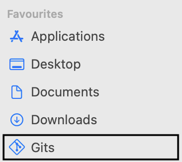
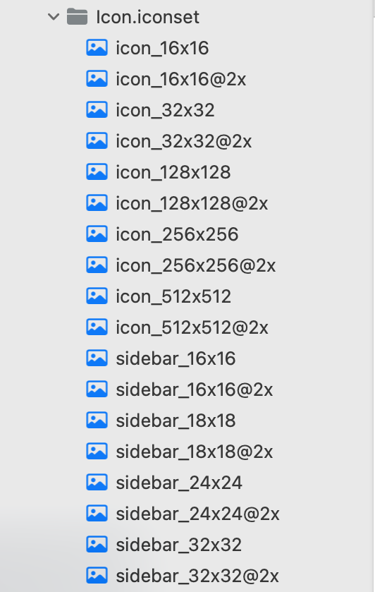
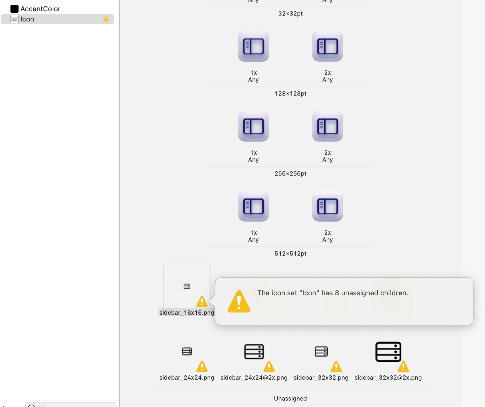

# GitIcon

GitIcon is a macOS application that adds a custom git icon to the Finder's sidebar for selected folders. This makes it easy to identify which folders are git repositories and which are not.

<p align="center"></p>

## Why GitIcon?

Adding custom sidebar icons to folder in macOS finder isn't possible after Big Sur. This is because Apple has removed the ability to add custom icons to folders. There are some alternatives that requires to disable SIP (System Integrity Protection) and use third party apps to add custom icons. GitIcon is a simple solution that doesn't require to disable SIP and doesn't use any third party apps.

## How it works?

GitIcon uses FinderSync extension to add custom sidebar icon to folders. The FinderSync extension is a macOS extension that allows developers to create finder utilities. The extension is written in Swift and uses `FIFinderSyncController` to add custom sidebar icon to folders.

## Development

### Requirements

- Xcode
- macOS 11.0 or later

### Build

1. Clone the repository

   ```bash
   git clone https://github.com/PradyumnaKrishna/git-icon.git
   ```

2. Open the project in Xcode
3. Update the path to the git folder by editing [`gitIconSync/URLs`](gitIconSync/URLs) file.
3. Build the project

### Installation

1. Download the latest release from [Releases](https://github.com/PradyumnaKrishna/git-icon/releases) or build it manually (Go directly to step 6).
2. Unzip the downloaded file.
3. Open the app content by right clicking on the app and selecting "Show Package Contents".
4. Do the same for the `gitIconSync.appex` file in the `Contents/PlugIns` folder.
5. Update the path to the git folder by editing `Content/Resources/URLs` file.
6. Move the app to the Applications folder.
7. Open the app, it will close automatically. Go to System Preferences -> Extensions -> Finder Extensions and enable GitIcon.
8. Your folder should now have a custom sidebar icon.

### Adding custom sidebar icon

There is a iconset ([`gitIcon/Icon.iconset`](gitIcon/Icon.iconset)) present for git icon in the project. Replace the icons in the iconset with your own icons. The file names of the icons must be identical to the existing icons, sidebar icons must be present (i.e. `sidebar_16x16.png`).

<p align="center"></p>

Create icns file from the iconset using the following command:

```bash
iconutil -c icns Icon.iconset
```

and load that `Icon.icns` file in the xcode project.

## Findings

I would like to share some of my findings while developing this project.

Adding sidebar icon to this xcode app wasn't easy, it took me a long time to figure out. I found two methods to add sidebar icon in this project:

### Adding iconset to project

Taking reference from [this reddit post](https://www.reddit.com/r/mac/comments/seig87/how_to_make_custom_finder_sidebar_icons_big_sur/) (special thanks), I crafted an `Icon.iconset` iconset containing icon and sidebar icons. Added `CFBundleIconFile` to project `Info.plist`, provided the icon name and loaded the iconset in the project.

But for some reason this doesn't worked for me.

<p align="center"></p>

I manually compipled the `iconset` to `icns` file using `iconutil` and it worked.

### Using SF Symbols

I come across another [Git repository](https://github.com/rknightuk/custom-finder-sidebar-icons) that uses SF Symbols to add sidebar icons. I tried this method and it worked. The only limitation with this approach is it is limited to SF Symbols, setting it via `CFBundleSymbolName`. I tried several methods to add custom icon using this approach but failed.

### Other findings

* When I created icon set inside `Assets.xcassets`, it gave a warning that "This icon set has unassigned children.". Those unassigned icons were the sidebar icons.

  <p align="center"></p>

* There is a option to add sidebar icon set (`Sidebar Icon.sidebariconset`) in `Assets.xcassets` but I weren't able to utilize that in project.

* I tried different ways to create iconset (created `iconset`, `sidebariconset`, `appiconset`, `imageset`, `symbolset`) and settings to specify icon files in `Info.plist` but nothing worked.

* The documentation is not great or updated by Apple, the only documentation I found is [this](https://developer.apple.com/library/archive/documentation/General/Conceptual/ExtensibilityPG/Finder.html#//apple_ref/doc/uid/TP40014214-CH15-SW15).

## Discussion

Feel free to share your thoughts and findings in [Discussions](https://github.com/PradyumnaKrishna/git-icon/discussions)

## References and Thanks

I would like to thank the following people and resources for helping me in this project:

* [How to make custom Finder sidebar icons (Big Sur)](https://www.reddit.com/r/mac/comments/seig87/how_to_make_custom_finder_sidebar_icons_big_sur/)
* [rknightuk/custom-finder-sidebar-icons](https://github.com/rknightuk/custom-finder-sidebar-icons)
* [FinderSync Documentation](https://developer.apple.com/library/archive/documentation/General/Conceptual/ExtensibilityPG/Finder.html#//apple_ref/doc/uid/TP40014214-CH15-SW15)

## License

GitIcon is licensed under the MIT License. See [LICENSE](LICENSE.md) for more information.
